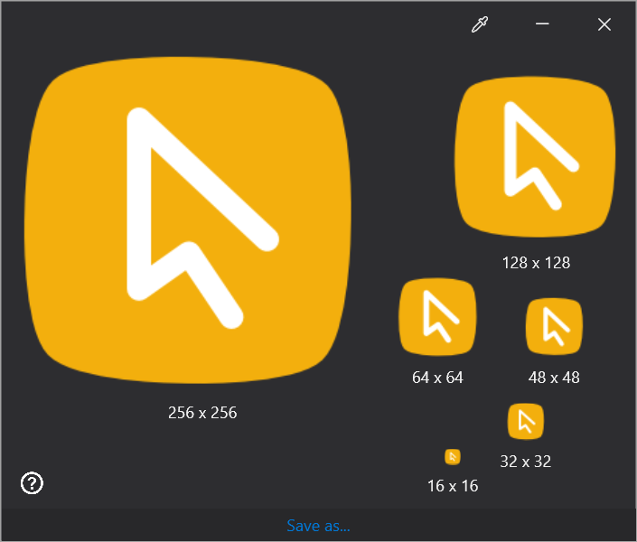

This is a simple application to build Windows 10 compatible ICO icon files from multiple PNG image files.

## Usage

This utility app simplifies the task of composing a Windows 10 compatible ICO file from multiple PNG images. When launching the app, you will be immediately presented with a simple window (see below) that allows you to drop any number of PNG images that you want to use to compose the icon. If there are no issues with the chosen files, they will be presented on the screen associated with the dimensions of the image. By pressing the "Save as..." button on the botto, of the windowanother dialog will be presented asking for the name and location where to save the built icon. This process will repeat indefinitely until the cancel button is pressed on either dialog.

Note that the app will perform very little checks on the images to be used to compose the icon, notably that it is sqared (same values for width and height), uses 32-bit colours (8- and 24-bit images, although valid for PNG files, will not be allowed) and no two images have the same dimensions. Otherwise, any image will be accepted.

Although the ICO file format has no requirements on how many images or which dimensions the icon images should have, this utility works only with the set of recommended sizes for Windows 10 icons: 16x16, 32x32, 48x48, 64x64 and 256x256. Note that Windows will generate internally an icon for 96x96 based on the 256x256 icon, so it has been considered unnecessary to provide an image with that dimension. If you need/want better control over this image, you may include a version of your image with this dimension.